# distributed-computing
distributed-computing

## Google三剑客:
- GFS: Google File System
- BigTable
- MapReduce
 
### GFS    
架构Master Work
Master存储index
Work存储对应文件

热点数据热平衡
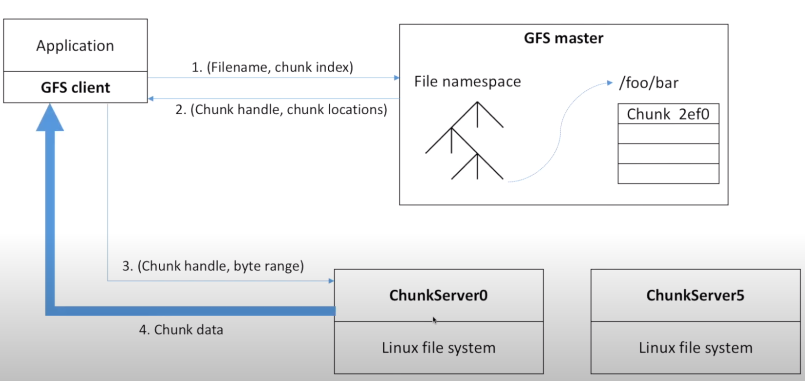

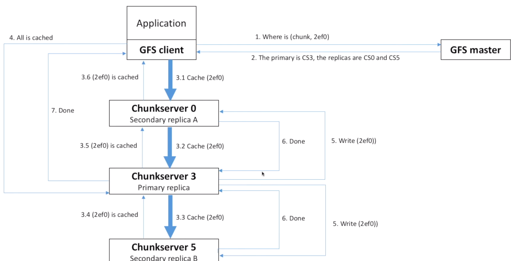

### Bigtable
传统

拆分
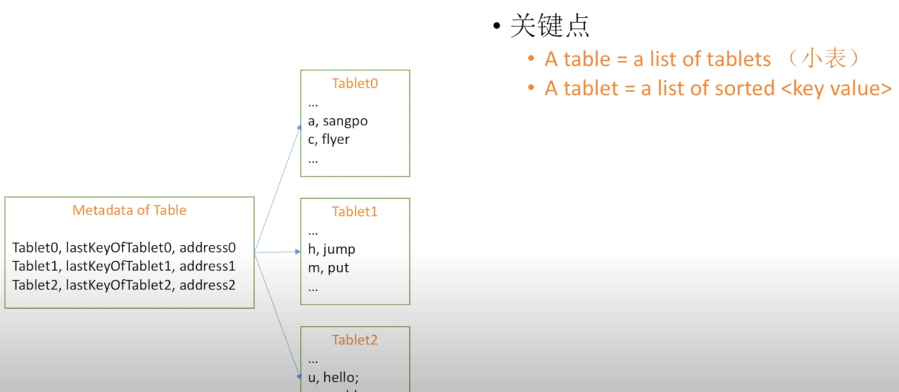
再拆分
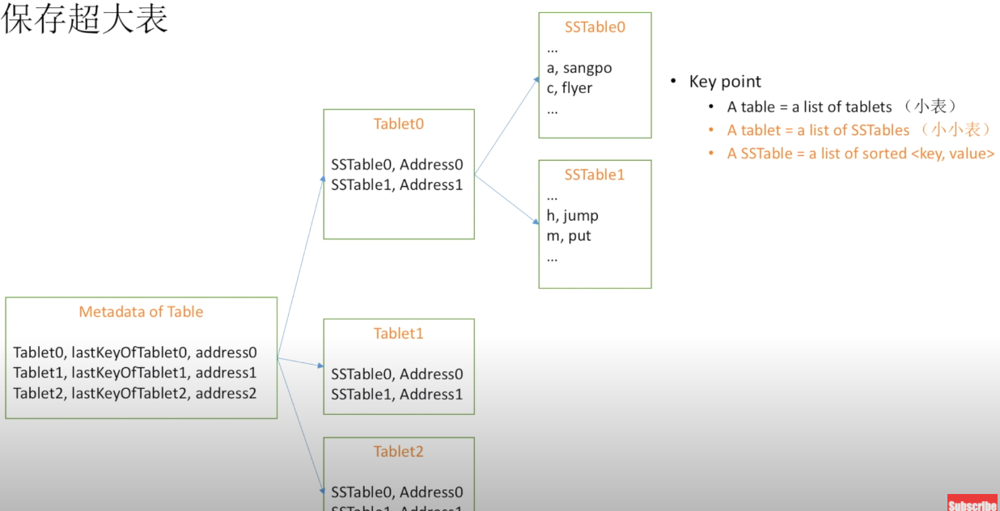
写数据    < buf size 写入内存  打log防止数据丢失   > bu size 写文件
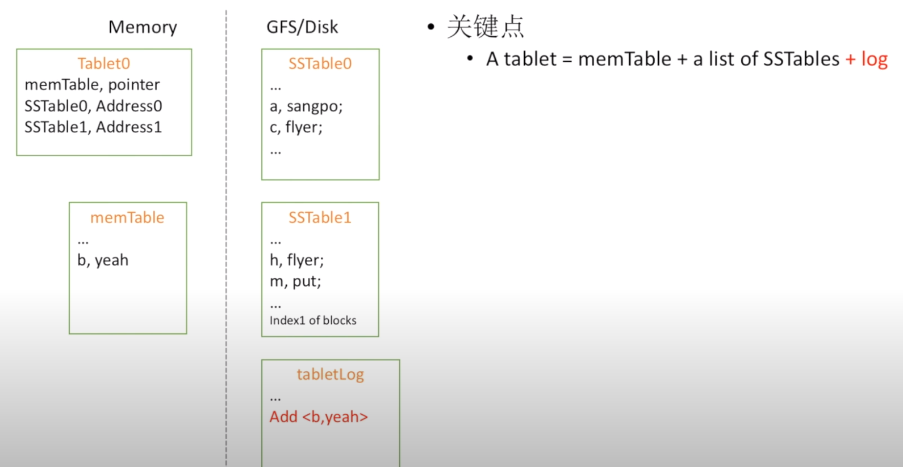
读数据
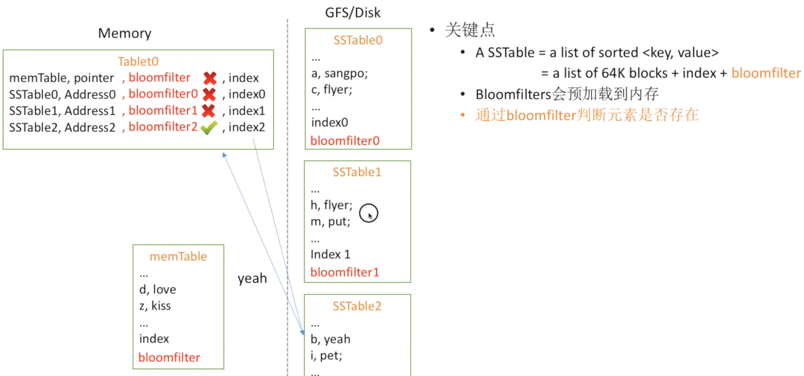
与GFS结合 
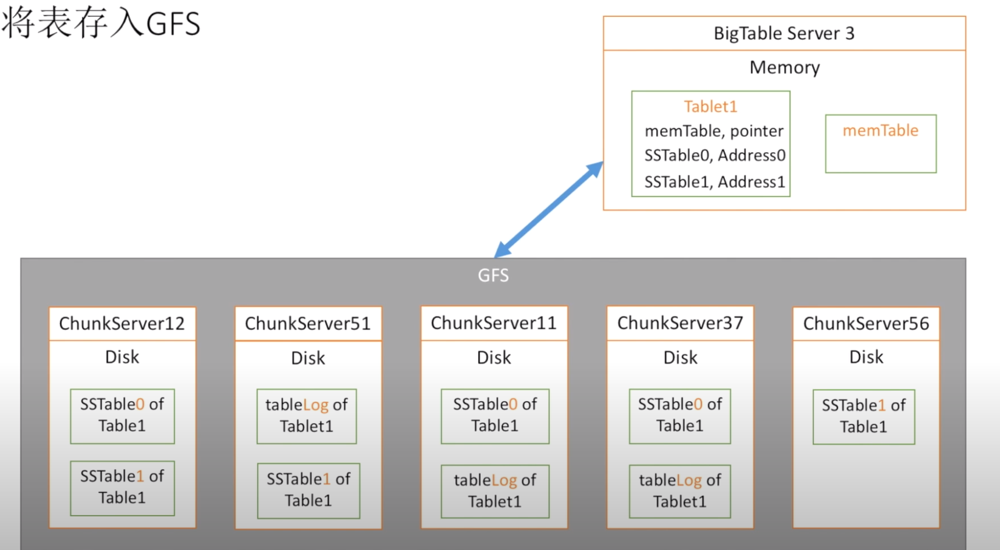
将逻辑视图转换为物理存储   
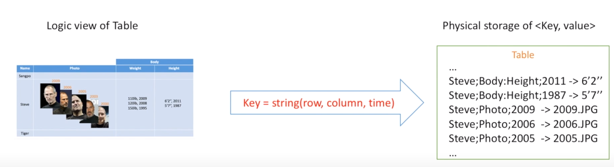
架构
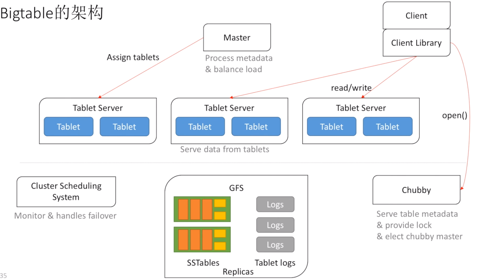

### MapReduce
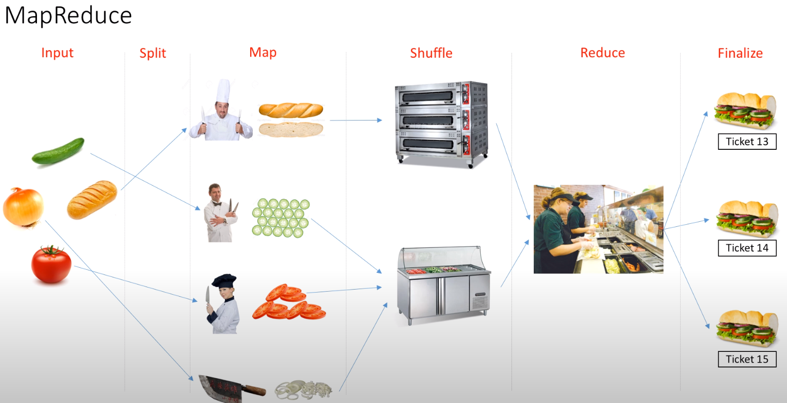
wordCount
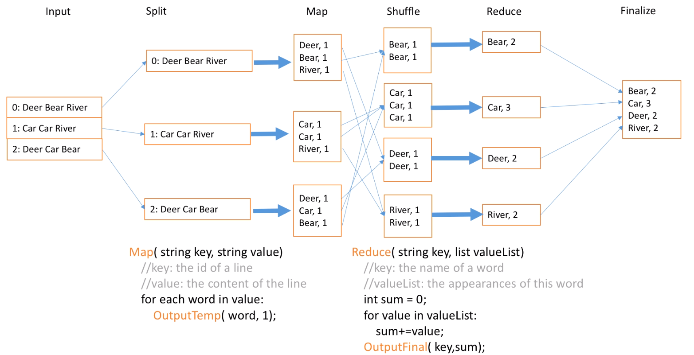
build inverted index
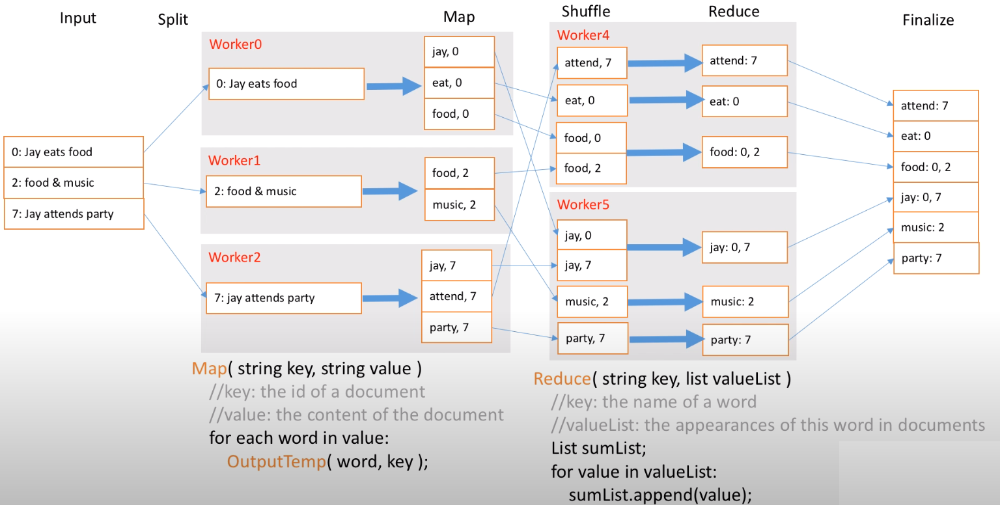
架构
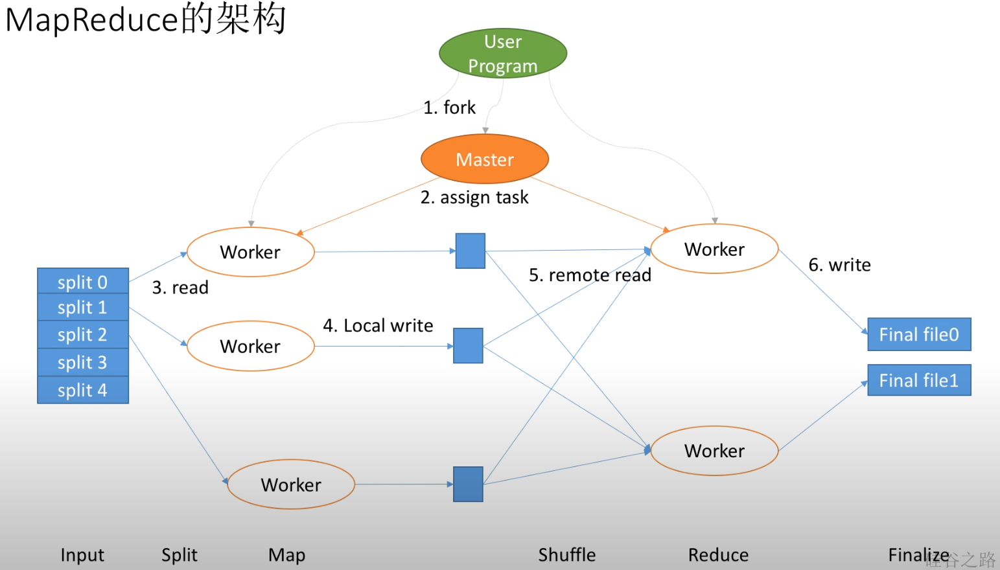
OK 我们现在用GO来实现MapReduce wordCount

